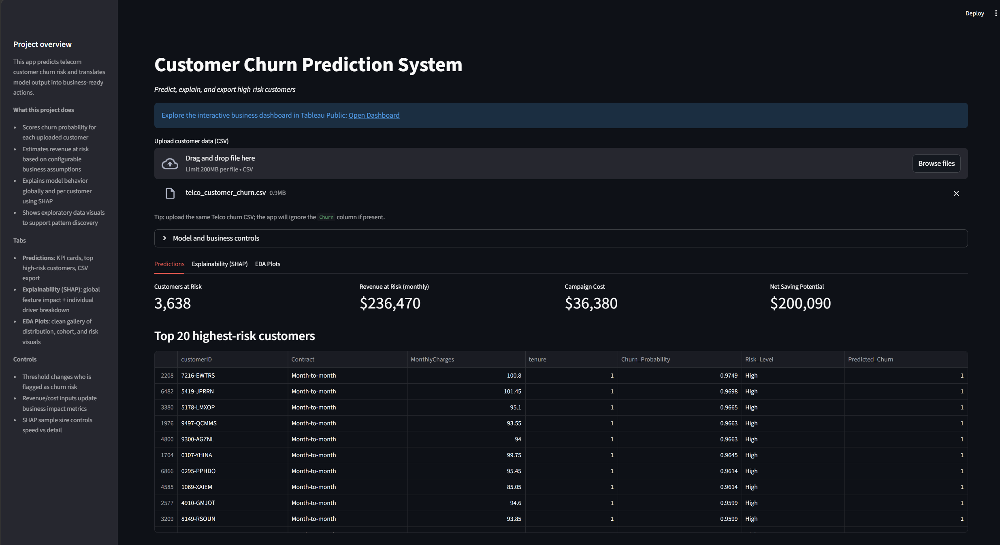
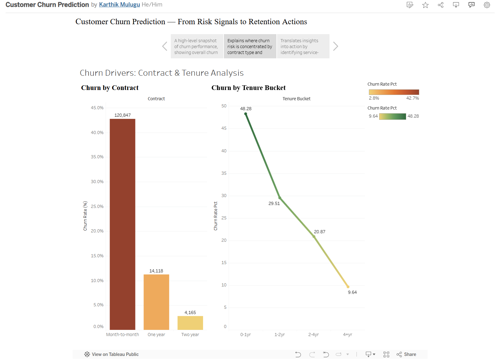

# Customer Churn Prediction System

End-to-end churn project that predicts at-risk customers, explains drivers, and supports retention decisions with business-ready outputs.

## Project Preview

### Streamlit App


### Tableau Dashboard


Tableau Public: [Customer Churn Prediction — From Risk Signals to Retention Actions](https://public.tableau.com/app/profile/karthik.mulugu/viz/CustomerChurnPrediction_17748873322730/CustomerChurnPredictionFromRiskSignalstoRetentionActions?publish=yes)

## Latest Metrics

| Metric | Value |
|---|---:|
| Recall (Churn) | 0.88 (threshold = 0.35) |
| ROC-AUC | 0.8462 |
| PR-AUC | 0.6632 |

### Business Cost Framing
- Cost of missing one churner: `$777/yr`
- Cost of false retention offer: `$10`
- Cost ratio (FN:FP): `78x`

## Key Findings
- Month-to-month contracts show **42.71%** churn vs **2.83%** for two-year contracts.
- Early-tenure customers (`tenure < 12`) churn at **48.28%** vs **17.49%** for `tenure >= 12`.
- Customers without support/security services churn far more: **TechSupport=No: 41.64% vs 15.17% (Yes)** and **OnlineSecurity=No: 41.77% vs 14.61% (Yes)**.
- High-charge month-to-month customers (`MonthlyCharges > 65`) churn at **51.75%** and account for **63.46%** of all churners.

## Business Recommendations
| Segment | Action | Est. Impact |
|---|---|---|
| High charges + month-to-month | Annual plan discount | ~20% churn reduction |
| Low tenure (<12 months) | Onboarding + proactive check-ins | ~15% early churn reduction |
| No tech support | Free 3-month support trial | ~10% churn reduction |

## Example Output
| CustomerID | Monthly Charges | Contract | Churn Probability | Risk Level |
|---|---:|---|---:|---|
| 7216-EWTRS | $100.80 | Month-to-month | 0.97 | High |
| 1927-QEWMY | $20.50 | Two year | 0.00 | Low |

Top SHAP drivers for `7216-EWTRS`: `tenure`, `MonthlyCharges`, `Contract_Month-to-month`, `InternetService_Fiber optic`, `PaymentMethod_Electronic check`.
Interpretation: short tenure + high charges + month-to-month contract is the highest-risk pattern. Recommended action: offer an annual-plan discount immediately.

## Reproducibility

From `churn-prediction/` run:

```bash
python -m pip install -r requirements.txt
python -m src.run_all
```

For tuning + validation:

```bash
python -m src.model_tuning
python -m unittest discover -s tests -p "test_*.py"
streamlit run app/streamlit_app.py
```

Expected baseline:

| Script | Expected metrics (approx) |
|---|---|
| `python -m src.model` | Recall 0.88, ROC-AUC 0.846, PR-AUC 0.663 |
| `python -m src.model_tuning` | 5-fold CV ROC-AUC + best tuned holdout metrics |

## Pipeline Commands

```bash
python -m src.data_processing
python -m src.eda_plots
python -m src.model
python -m src.shap_analysis
python -m src.export_tableau
```

## 5-Fold CV + Formal Tuning

- Script: `src/model_tuning.py`
- Method: `RandomizedSearchCV` + `StratifiedKFold(n_splits=5)`
- Output: tuned best params, CV ROC-AUC, holdout ROC/PR/Recall, and saved tuned model at `models/xgb_model.pkl`

## Tests

Preprocessing checks in `tests/test_preprocessing.py`:
- `TotalCharges` is numeric / non-null after cleaning
- required feature columns exist in `churn_features`

## Streamlit App

The app includes:
- Tab 1: Predictions + KPI + CSV export + model card
- Tab 2: SHAP global + customer-level explanation
- Tab 3: Clean EDA gallery with selectable full-size plot

Recommended threshold for recall-focused targeting: `0.35`.

## Tableau Export

Tableau data workbook: `dashboard/exports/tableau_exports.xlsx`

Tableau dashboard workbook location: `dashboard/Customer Churn Prediction.twb`

Final Tableau structure:
- Dashboard 1: KPI Overview
- Dashboard 2: Churn Drivers: Contract & Tenure Analysis
- Dashboard 3: Retention Action Layer: Service Gaps & High-Risk Segments
- Story: 3-point narrative

## Data Note

The IBM Telco dataset does not contain support ticket counts. Support impact is modeled using service-availability proxies (`TechSupport`, `OnlineSecurity`).

## How Findings Were Calculated

All percentages are computed from `data/processed/churn_features.db`:

```sql
-- 1) Contract churn rates (42.71% vs 2.83%)
SELECT Contract, ROUND(AVG(Churn) * 100.0, 2) AS churn_rate_pct
FROM churn_features
GROUP BY Contract;

-- 2) Early vs long tenure churn (48.28% vs 17.49%)
SELECT
  ROUND(AVG(CASE WHEN tenure < 12 THEN Churn END) * 100.0, 2) AS churn_lt_12_pct,
  ROUND(AVG(CASE WHEN tenure >= 12 THEN Churn END) * 100.0, 2) AS churn_ge_12_pct
FROM churn_features;

-- 3) TechSupport / OnlineSecurity no-vs-yes churn rates
SELECT TechSupport, ROUND(AVG(Churn) * 100.0, 2) AS churn_rate_pct
FROM raw_data
GROUP BY TechSupport;

SELECT OnlineSecurity, ROUND(AVG(Churn) * 100.0, 2) AS churn_rate_pct
FROM raw_data
GROUP BY OnlineSecurity;

-- 4) High-charge month-to-month segment stats (51.75%, 63.46%)
SELECT
  ROUND(AVG(CASE
      WHEN Contract='Month-to-month' AND MonthlyCharges > 65 THEN Churn
  END) * 100.0, 2) AS high_charge_mtm_churn_rate_pct,
  ROUND(
    SUM(CASE
      WHEN Contract='Month-to-month' AND MonthlyCharges > 65 AND Churn=1 THEN 1
      ELSE 0
    END) * 100.0 / SUM(CASE WHEN Churn=1 THEN 1 ELSE 0 END),
    2
  ) AS share_of_all_churners_pct
FROM raw_data;
```
